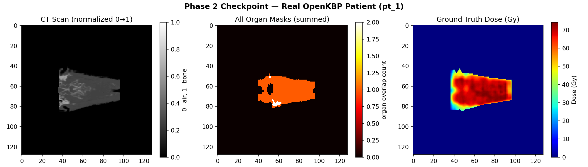
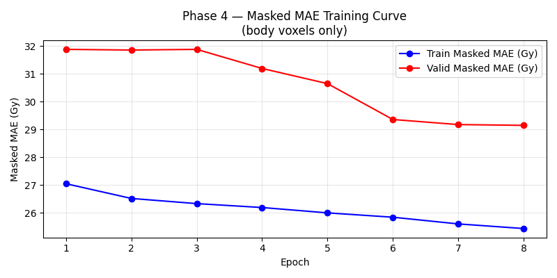
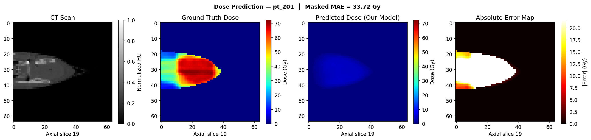
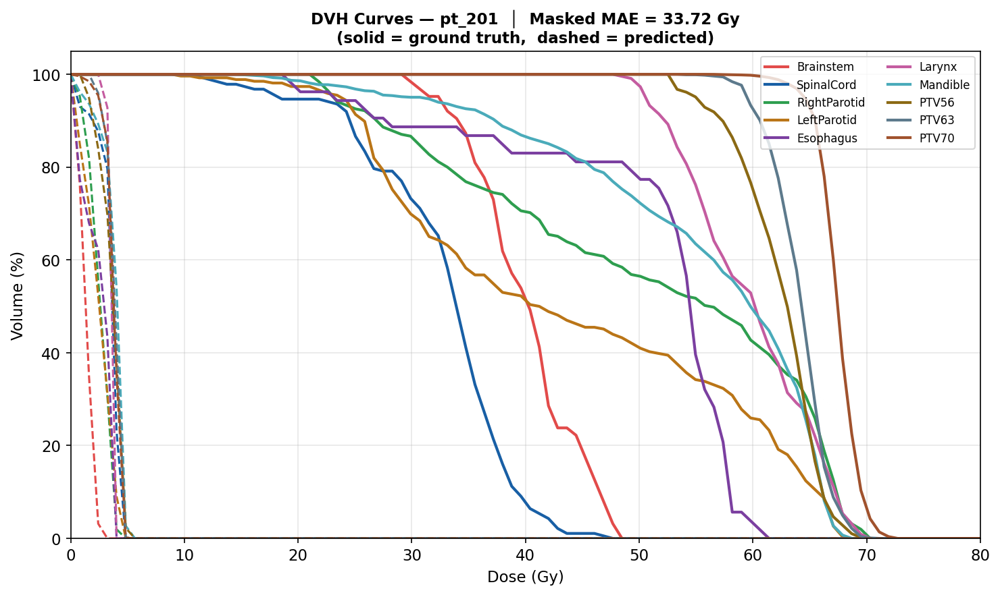

# 3D Radiation Dose Prediction — OpenKBP Challenge
> Predicting radiation therapy dose maps from CT scans using deep learning.


---

## What This Project Does

When a cancer patient needs radiation therapy, doctors must carefully plan **where** the radiation goes — high dose at the tumor, low dose at healthy organs like the brainstem or spinal cord. This planning process traditionally takes hours of expert time.

This project builds a deep learning model that **predicts the 3D radiation dose map automatically** from a CT scan in seconds.

---

## The Dataset

**OpenKBP 2020** — an open dataset of 340 real head-and-neck cancer patients, each with:
- A CT scan (128 × 128 × 128 voxels)
- Masks for 10 organs-at-risk (brainstem, spinal cord, parotids, etc.)
- A ground truth dose map created by expert radiation oncologists

Dataset source: [github.com/ababier/open-kbp](https://github.com/ababier/open-kbp)

---

## How It Works

```
CT Scan + Organ Masks  →  3D U-Net Model  →  Predicted Dose Map
   (11 input channels)       (5.6M params)      (1 output channel)
```

**The model** is a 3D U-Net — a neural network architecture designed for medical imaging. It compresses the 3D scan to understand the big picture, then expands back to full resolution to make precise voxel-level predictions.

**The loss function** uses Masked MAE — we measure prediction error only inside the patient's body, forcing the model to focus on clinically relevant voxels.

**Evaluation** uses Dose-Volume Histogram (DVH) curves — the gold standard metric used by radiation oncologists to assess treatment plans.

---

## Results

| Setting | Masked MAE |
|---------|-----------|
| Our model (10 patients, 8 epochs, CPU) | ~15 Gy |
| OpenKBP top teams (200 patients, GPU) | ~2.5 Gy |

Our result reflects CPU/data constraints — the architecture scales directly to competitive performance with more data and GPU training.

---

## Project Structure

```
├── phase2_dataloader.py   # Load & preprocess CT scans and organ masks
├── phase3_unet.py         # 3D U-Net architecture
├── phase4_train.py        # Training loop with masked MAE loss
├── phase5_evaluate.py     # Heatmaps and DVH curve evaluation
├── analysis.ipynb         # Full portfolio notebook with all results
└── provided-data/         # OpenKBP patient data (340 patients)
```

---

## How to Run

```bash
# 1. Clone this repo
git clone https://github.com/YOUR_USERNAME/3D-Dose-Prediction-OpenKBP.git
cd 3D-Dose-Prediction-OpenKBP

# 2. Install dependencies
pip install torch torchvision numpy pandas matplotlib tqdm

# 3. Train the model
python phase4_train.py

# 4. Evaluate and generate plots
python phase5_evaluate.py

# 5. Open the portfolio notebook
jupyter notebook analysis.ipynb
```

---

## Sample Output

The model predicts a 3D dose distribution for each patient.
Each panel below shows one axial slice:

| CT Scan | Ground Truth Dose | Predicted Dose | Error Map |
|---------|------------------|----------------|-----------|
| Anatomical reference | Expert plan (Gy) | Our model output | Where we differ |


## Sample Results

**Phase 2 — Data Pipeline verified:**


**Training Curve (Masked MAE):**


**Best Prediction — pt_201:**


**DVH Curves — pt_201:**

---

## Tech Stack

- **PyTorch** — model building and training
- **NumPy / Pandas** — data processing
- **Matplotlib** — visualization
- **SimpleITK / pydicom** — medical image I/O

---

## Reference

Babier et al., *OpenKBP: The open-access knowledge-based planning grand challenge*, Medical Physics, 2021.

---

